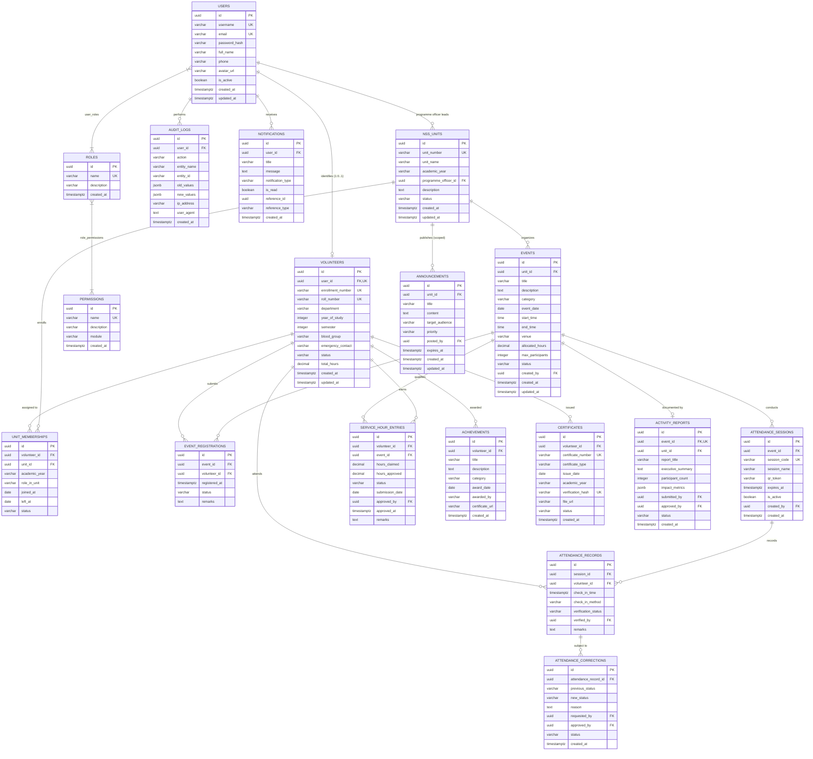

# Relational Database Architecture and Entity-Relationship Specification

## 1. Executive Summary & Design Principles

The National Service Scheme (NSS) Management Platform for B.Tech Institutions is backed by PostgreSQL 17 (managed via Supabase). The data model is normalized to Third Normal Form (3NF) to guarantee transactional integrity, eliminate redundancy, and preserve strict historical records across multi-year academic cycles.

### Core Architectural Invariants:
1. **Surrogate Primary Keys**: All relational entities employ standard PostgreSQL `UUID` primary keys (`DEFAULT gen_random_uuid()`) to eliminate enumeration attacks, support distributed generation, and prevent sequence collision during multi-node synchronization.
2. **Referential Integrity**: All relationships are enforced via explicit Foreign Key (`FK`) constraints. Cascading deletes (`ON DELETE CASCADE`) are restricted strictly to owned children (e.g., `role_permissions` owned by roles/permissions, `attendance_records` owned by sessions). Operational business entities (volunteers, units, events) enforce `ON DELETE RESTRICT` or `ON DELETE SET NULL` to preserve historical audits.
3. **Double-Entry Style Service Hour Ledger**: Service hours are tracked as an immutable ledger of transactions (`service_hour_entries`) rather than a simple mutable counter on the volunteer record. The `volunteers.total_hours` column acts as an indexed materialized summary that must always reconcile with approved ledger entries.
4. **Optimistic & Pessimistic Concurrency**: Event registrations and live QR attendance use row-level locking (`SELECT ... FOR UPDATE`) and database unique constraints (`UNIQUE(event_id, volunteer_id)`, `UNIQUE(session_id, volunteer_id)`) to eliminate race conditions under peak student registration loads.
5. **Database Migration Governance**: All structural changes are governed through Flyway versioned migrations (`backend/src/main/resources/db/migration/V{N}__{description}.sql`). Direct schema mutations in staging or production environments are strictly prohibited.

---

## 2. Visual Entity-Relationship Diagram (Mermaid)

The complete visual ER model maintained in the institutional design repository is represented below. The primary interactive FigJam board is accessible at:
[NSS Institutional FigJam ER Board](https://www.figma.com/board/5J0aK0q3w7sLp5fB9k5s5t/NSS-College-App-ER-Diagram)

---

## 3. Entity Catalogue & Column Specifications

### 3.1 Identity & Access Management (IAM)

#### `users`
Represents all system actors across student volunteers, faculty leaders, programme officers, and system administrators.
- `id` (`UUID`, PK, `DEFAULT gen_random_uuid()`): Unique account identifier.
- `username` (`VARCHAR(50)`, UNIQUE, NOT NULL): Institutional login identifier (e.g. Roll Number or Staff ID).
- `email` (`VARCHAR(100)`, UNIQUE, NOT NULL): Official college email address.
- `password_hash` (`VARCHAR(255)`, NOT NULL): BCrypt hash (minimum cost factor 12).
- `full_name` (`VARCHAR(100)`, NOT NULL): Complete legal name.
- `phone` (`VARCHAR(20)`): Contact phone number.
- `avatar_url` (`VARCHAR(255)`): Profile photo URI.
- `is_active` (`BOOLEAN`, NOT NULL, DEFAULT true): Account state flag.
- `created_at` (`TIMESTAMPTZ`, NOT NULL, DEFAULT now()): Registration timestamp.
- `updated_at` (`TIMESTAMPTZ`, NOT NULL, DEFAULT now()): Modification timestamp.

#### `roles`
System access roles governing user privilege envelopes.
- `id` (`UUID`, PK, `DEFAULT gen_random_uuid()`): Role ID.
- `name` (`VARCHAR(50)`, UNIQUE, NOT NULL): Machine-readable identifier: `ADMIN`, `FACULTY_COORDINATOR`, `PROGRAMME_OFFICER`, `STUDENT_LEADER`, `VOLUNTEER`.
- `description` (`VARCHAR(255)`): Human-readable scope summary.
- `created_at` (`TIMESTAMPTZ`, NOT NULL, DEFAULT now()).

#### `permissions`
Granular atomic capabilities assigned to roles.
- `id` (`UUID`, PK, `DEFAULT gen_random_uuid()`): Permission ID.
- `name` (`VARCHAR(100)`, UNIQUE, NOT NULL): e.g. `USERS_MANAGE`, `UNITS_MANAGE`, `VOLUNTEERS_MANAGE`, `EVENTS_MANAGE`, `ATTENDANCE_MANAGE`, `SERVICE_HOURS_MANAGE`, `REPORTS_EXPORT`.
- `description` (`VARCHAR(255)`): Functional scope description.
- `module` (`VARCHAR(50)`, NOT NULL): Domain grouping (`USERS`, `UNITS`, `VOLUNTEERS`, `EVENTS`, `ATTENDANCE`, `SERVICE_HOURS`, `ANNOUNCEMENTS`, `REPORTS`).
- `created_at` (`TIMESTAMPTZ`, NOT NULL, DEFAULT now()).

#### `user_roles`
Composite junction mapping users to security roles.
- `user_id` (`UUID`, FK `users.id` ON DELETE CASCADE, PK).
- `role_id` (`UUID`, FK `roles.id` ON DELETE CASCADE, PK).

#### `role_permissions`
Composite junction mapping roles to fine-grained capabilities.
- `role_id` (`UUID`, FK `roles.id` ON DELETE CASCADE, PK).
- `permission_id` (`UUID`, FK `permissions.id` ON DELETE CASCADE, PK).

---

### 3.2 Organizational Structure & Volunteer Management

#### `nss_units`
Constituent operational NSS units within the institution (e.g. Unit 1, Unit 2).
- `id` (`UUID`, PK, `DEFAULT gen_random_uuid()`): Unit identifier.
- `unit_number` (`VARCHAR(20)`, UNIQUE, NOT NULL): Official governmental designation (e.g. `UNIT-01`).
- `unit_name` (`VARCHAR(100)`, NOT NULL): Descriptive name (e.g. `Tech Community Outreach Unit`).
- `academic_year` (`VARCHAR(20)`, NOT NULL): Active cycle (e.g. `2025-2026`).
- `programme_officer_id` (`UUID`, FK `users.id` ON DELETE RESTRICT): Assigned faculty programme officer.
- `description` (`TEXT`): Focus area or department alignment.
- `status` (`VARCHAR(20)`, NOT NULL, DEFAULT 'ACTIVE'): `ACTIVE`, `INACTIVE`, `DORMANT`.
- `created_at` (`TIMESTAMPTZ`, NOT NULL, DEFAULT now()).
- `updated_at` (`TIMESTAMPTZ`, NOT NULL, DEFAULT now()).

#### `volunteers`
Student volunteer demographic and academic profiles.
- `id` (`UUID`, PK, `DEFAULT gen_random_uuid()`): Volunteer identifier.
- `user_id` (`UUID`, UNIQUE, NOT NULL, FK `users.id` ON DELETE RESTRICT): Authentication reference.
- `enrollment_number` (`VARCHAR(50)`, UNIQUE, NOT NULL): University NSS Cell registration code.
- `roll_number` (`VARCHAR(50)`, UNIQUE, NOT NULL): College academic roll number.
- `department` (`VARCHAR(50)`, NOT NULL): Academic branch (e.g. `CSE`, `ECE`, `MECH`).
- `year_of_study` (`INTEGER`, NOT NULL): Current academic year (1, 2, 3, 4).
- `semester` (`INTEGER`, NOT NULL): Academic semester (1-8).
- `blood_group` (`VARCHAR(10)`): Emergency blood typing (e.g. `O+`, `B+`).
- `emergency_contact` (`VARCHAR(20)`): Parent/guardian phone.
- `status` (`VARCHAR(20)`, NOT NULL, DEFAULT 'ACTIVE'): `ACTIVE`, `COMPLETED`, `INACTIVE`, `DISQUALIFIED`.
- `total_hours` (`DECIMAL(6,2)`, NOT NULL, DEFAULT 0.00): Materialized sum of approved service hours.
- `created_at` (`TIMESTAMPTZ`, NOT NULL, DEFAULT now()).
- `updated_at` (`TIMESTAMPTZ`, NOT NULL, DEFAULT now()).

#### `unit_memberships`
Historical and active unit assignment ledger.
- `id` (`UUID`, PK, `DEFAULT gen_random_uuid()`): Membership record ID.
- `volunteer_id` (`UUID`, NOT NULL, FK `volunteers.id` ON DELETE CASCADE).
- `unit_id` (`UUID`, NOT NULL, FK `nss_units.id` ON DELETE CASCADE).
- `academic_year` (`VARCHAR(20)`, NOT NULL): e.g. `2025-2026`.
- `role_in_unit` (`VARCHAR(50)`, NOT NULL, DEFAULT 'MEMBER'): `MEMBER`, `TEAM_LEAD`, `CAMP_COORDINATOR`.
- `joined_at` (`DATE`, NOT NULL, DEFAULT CURRENT_DATE): Assignment date.
- `left_at` (`DATE`): De-registration or graduation date.
- `status` (`VARCHAR(20)`, NOT NULL, DEFAULT 'ACTIVE'): `ACTIVE`, `TRANSFERRED`, `COMPLETED`.
- Constraint: `UNIQUE(volunteer_id, unit_id, academic_year)`.

---

### 3.3 Event Management & Registration

#### `events`
Community activities, awareness campaigns, blood drives, and special rural camps.
- `id` (`UUID`, PK, `DEFAULT gen_random_uuid()`): Event ID.
- `unit_id` (`UUID`, FK `nss_units.id` ON DELETE SET NULL): Organizing unit (null for college-wide events).
- `title` (`VARCHAR(200)`, NOT NULL): Event headline.
- `description` (`TEXT`, NOT NULL): Detailed scope, objectives, and agenda.
- `category` (`VARCHAR(50)`, NOT NULL): `COMMUNITY_SERVICE`, `BLOOD_DONATION`, `ENVIRONMENTAL`, `HEALTH_CAMP`, `NATIONAL_DAY`, `SPECIAL_CAMP`.
- `event_date` (`DATE`, NOT NULL): Scheduled execution date.
- `start_time` (`TIME`, NOT NULL): Event commencement time.
- `end_time` (`TIME`, NOT NULL): Event conclusion time.
- `venue` (`VARCHAR(200)`, NOT NULL): Physical location or campus venue.
- `allocated_hours` (`DECIMAL(4,2)`, NOT NULL): Standard service hours credit awarded upon full completion.
- `max_participants` (`INTEGER`, NOT NULL, DEFAULT 100): Registration capacity ceiling.
- `status` (`VARCHAR(20)`, NOT NULL, DEFAULT 'DRAFT'): State machine status (`DRAFT`, `PUBLISHED`, `OPEN`, `IN_PROGRESS`, `COMPLETED`, `CANCELLED`).
- `created_by` (`UUID`, NOT NULL, FK `users.id` ON DELETE RESTRICT): Creator user ID.
- `created_at` (`TIMESTAMPTZ`, NOT NULL, DEFAULT now()).
- `updated_at` (`TIMESTAMPTZ`, NOT NULL, DEFAULT now()).

#### `event_registrations`
Volunteer self-registration roster.
- `id` (`UUID`, PK, `DEFAULT gen_random_uuid()`): Registration ID.
- `event_id` (`UUID`, NOT NULL, FK `events.id` ON DELETE CASCADE).
- `volunteer_id` (`UUID`, NOT NULL, FK `volunteers.id` ON DELETE CASCADE).
- `registered_at` (`TIMESTAMPTZ`, NOT NULL, DEFAULT now()): Enrollment timestamp.
- `status` (`VARCHAR(20)`, NOT NULL, DEFAULT 'REGISTERED'): `REGISTERED`, `CONFIRMED`, `WAITLISTED`, `CANCELLED`.
- `remarks` (`TEXT`): Notes or dietary/special constraints.
- Constraint: `UNIQUE(event_id, volunteer_id)` prevents duplicate enrollments.

---

### 3.4 Attendance & Cryptographic QR Verification

#### `attendance_sessions`
Active attendance windows generated during an event.
- `id` (`UUID`, PK, `DEFAULT gen_random_uuid()`): Session ID.
- `event_id` (`UUID`, NOT NULL, FK `events.id` ON DELETE CASCADE).
- `session_code` (`VARCHAR(50)`, UNIQUE, NOT NULL): Short numeric or alpha code (e.g. `ATT-2026-9081`).
- `session_name` (`VARCHAR(100)`, NOT NULL): Session descriptor (e.g. `Morning Roll Call`, `Field Wrap-up`).
- `qr_token` (`VARCHAR(255)`, NOT NULL): HMAC-SHA256 signature payload rotated periodically.
- `expires_at` (`TIMESTAMPTZ`, NOT NULL): Hard expiration cut-off timestamp.
- `is_active` (`BOOLEAN`, NOT NULL, DEFAULT true): Master session switch.
- `created_by` (`UUID`, NOT NULL, FK `users.id` ON DELETE RESTRICT): Authorizing faculty officer.
- `created_at` (`TIMESTAMPTZ`, NOT NULL, DEFAULT now()).

#### `attendance_records`
Individual volunteer attendance check-ins.
- `id` (`UUID`, PK, `DEFAULT gen_random_uuid()`): Record ID.
- `session_id` (`UUID`, NOT NULL, FK `attendance_sessions.id` ON DELETE CASCADE).
- `volunteer_id` (`UUID`, NOT NULL, FK `volunteers.id` ON DELETE CASCADE).
- `check_in_time` (`TIMESTAMPTZ`, NOT NULL, DEFAULT now()): Physical check-in timestamp.
- `check_in_method` (`VARCHAR(20)`, NOT NULL, DEFAULT 'QR'): Verification mode (`QR`, `MANUAL`, `RFID`, `OFFLINE_SYNC`).
- `verification_status` (`VARCHAR(20)`, NOT NULL, DEFAULT 'VERIFIED'): `VERIFIED`, `FLAGGED`, `REJECTED`.
- `verified_by` (`UUID`, FK `users.id` ON DELETE SET NULL): Verifying supervisor (null for automated QR scan).
- `remarks` (`TEXT`): Supervisor observations or verification notes.
- Constraint: `UNIQUE(session_id, volunteer_id)` enforces single check-in per session.

#### `attendance_corrections`
Formal audit trail for post-event attendance adjustments.
- `id` (`UUID`, PK, `DEFAULT gen_random_uuid()`): Correction ID.
- `attendance_record_id` (`UUID`, NOT NULL, FK `attendance_records.id` ON DELETE CASCADE).
- `previous_status` (`VARCHAR(20)`, NOT NULL): Pre-adjustment status.
- `new_status` (`VARCHAR(20)`, NOT NULL): Post-adjustment status.
- `reason` (`TEXT`, NOT NULL): Mandatory justification.
- `requested_by` (`UUID`, NOT NULL, FK `users.id` ON DELETE RESTRICT): Applicant or student leader.
- `approved_by` (`UUID`, NOT NULL, FK `users.id` ON DELETE RESTRICT): Approving Programme Officer.
- `status` (`VARCHAR(20)`, NOT NULL, DEFAULT 'APPROVED'): `PENDING`, `APPROVED`, `REJECTED`.
- `created_at` (`TIMESTAMPTZ`, NOT NULL, DEFAULT now()).

---

### 3.5 Service Hour Accounting Ledger

#### `service_hour_entries`
The core accounting ledger for community service credit.
- `id` (`UUID`, PK, `DEFAULT gen_random_uuid()`): Entry ID.
- `volunteer_id` (`UUID`, NOT NULL, FK `volunteers.id` ON DELETE CASCADE): Credited volunteer.
- `event_id` (`UUID`, FK `events.id` ON DELETE SET NULL): Associated sanctioned event (optional for direct special assignments).
- `hours_claimed` (`DECIMAL(4,2)`, NOT NULL): Service credit claimed.
- `hours_approved` (`DECIMAL(4,2)`, NOT NULL, DEFAULT 0.00): Credit sanctioned by Programme Officer.
- `status` (`VARCHAR(20)`, NOT NULL, DEFAULT 'PENDING'): Lifecycle status (`PENDING`, `APPROVED`, `REJECTED`, `ADJUSTED`).
- `submission_date` (`DATE`, NOT NULL, DEFAULT CURRENT_DATE): Entry creation date.
- `approved_by` (`UUID`, FK `users.id` ON DELETE SET NULL): Adjudicating Programme Officer.
- `approved_at` (`TIMESTAMPTZ`): Timestamp of formal approval.
- `remarks` (`TEXT`): Activity explanation or rejection reasoning.

---

### 3.6 Communication & System Telemetry

#### `announcements`
Targeted broadcasts and operational notifications.
- `id` (`UUID`, PK, `DEFAULT gen_random_uuid()`): Bulletin ID.
- `unit_id` (`UUID`, FK `nss_units.id` ON DELETE CASCADE): Scoped unit (null for institution-wide broadcasts).
- `title` (`VARCHAR(200)`, NOT NULL): Bulletin headline.
- `content` (`TEXT`, NOT NULL): Full message body (markdown supported).
- `target_audience` (`VARCHAR(50)`, NOT NULL, DEFAULT 'ALL'): `ALL`, `VOLUNTEERS`, `LEADERS`, `OFFICERS`.
- `priority` (`VARCHAR(20)`, NOT NULL, DEFAULT 'NORMAL'): `LOW`, `NORMAL`, `HIGH`, `URGENT`.
- `posted_by` (`UUID`, NOT NULL, FK `users.id` ON DELETE RESTRICT): Authorizing staff user.
- `expires_at` (`TIMESTAMPTZ`): Automatic unpinning/deprecation cut-off.
- `created_at` (`TIMESTAMPTZ`, NOT NULL, DEFAULT now()).
- `updated_at` (`TIMESTAMPTZ`, NOT NULL, DEFAULT now()).

#### `notifications`
Per-user in-app notification inbox.
- `id` (`UUID`, PK, `DEFAULT gen_random_uuid()`): Message ID.
- `user_id` (`UUID`, NOT NULL, FK `users.id` ON DELETE CASCADE): Recipient account.
- `title` (`VARCHAR(100)`, NOT NULL): Brief subject line.
- `message` (`TEXT`, NOT NULL): Summary text.
- `notification_type` (`VARCHAR(50)`, NOT NULL): `EVENT_REMINDER`, `ATTENDANCE_CONFIRMED`, `HOURS_APPROVED`, `ANNOUNCEMENT`.
- `is_read` (`BOOLEAN`, NOT NULL, DEFAULT false): Read receipt state.
- `reference_id` (`UUID`): Linked entity ID (e.g. event ID, announcement ID).
- `reference_type` (`VARCHAR(50)`): Polymorphic type descriptor (`EVENT`, `ANNOUNCEMENT`, `SERVICE_HOUR`).
- `created_at` (`TIMESTAMPTZ`, NOT NULL, DEFAULT now()).

#### `audit_logs`
Immutable supervisory compliance trail.
- `id` (`UUID`, PK, `DEFAULT gen_random_uuid()`): Log ID.
- `user_id` (`UUID`, FK `users.id` ON DELETE SET NULL): Responsible user.
- `action` (`VARCHAR(100)`, NOT NULL): Action identifier (e.g. `CREATE_EVENT`, `APPROVE_HOURS`, `DELETE_UNIT`).
- `entity_name` (`VARCHAR(100)`, NOT NULL): Target table/domain.
- `entity_id` (`VARCHAR(100)`, NOT NULL): Target entity primary key string.
- `old_values` (`JSONB`): Pre-mutation state snapshot.
- `new_values` (`JSONB`): Post-mutation state snapshot.
- `ip_address` (`VARCHAR(45)`): Request IP address (IPv4 or IPv6).
- `user_agent` (`TEXT`): Client browser or agent signature.
- `created_at` (`TIMESTAMPTZ`, NOT NULL, DEFAULT now()): Write timestamp.

---

## 4. Performance Indexing & Query Optimization Strategy

To sustain sub-100ms API response times across tables hosting tens of thousands of student records, the following indexing schema is maintained:

1. **Foreign Key Performance Indexes**:
   - `idx_volunteers_user_id` ON `volunteers(user_id)`
   - `idx_nss_units_po` ON `nss_units(programme_officer_id)`
   - `idx_unit_memberships_vol_unit` ON `unit_memberships(volunteer_id, unit_id)`
   - `idx_events_unit_date` ON `events(unit_id, event_date DESC)`
   - `idx_registrations_event` ON `event_registrations(event_id, status)`
   - `idx_attendance_sessions_event` ON `attendance_sessions(event_id, is_active)`
   - `idx_attendance_records_session` ON `attendance_records(session_id, volunteer_id)`
   - `idx_service_hours_volunteer_status` ON `service_hours_entries(volunteer_id, status)`

2. **Temporal & Filter Indexes**:
   - `idx_events_status_date` ON `events(status, event_date)`
   - `idx_announcements_created` ON `announcements(created_at DESC)`
   - `idx_notifications_user_unread` ON `notifications(user_id, is_read) WHERE is_read = false`
   - `idx_audit_logs_created` ON `audit_logs(created_at DESC)`

3. **JSONB GIN Indexing**:
   - `idx_audit_logs_new_vals` ON `audit_logs USING GIN (new_values)` (permits fast forensic searches on nested fields).

---

## 5. Database Migration History & Directory Structure

All migrations are maintained under `backend/src/main/resources/db/migration/`:

| Version | Migration Script | Scope & Summary |
| :--- | :--- | :--- |
| **V1** | `V1__init_schema.sql` | Core schema initialization (`users`, `roles`, `permissions`, `volunteers`, `units`, `events`, `registrations`). |
| **V2** | `V2__seed_roles_and_admin.sql` | Baseline role dictionary, initial system administrator account, and default permission sets. |
| **V3** | `V3__attendance_and_hours.sql` | Attendance sessions, cryptographic QR token support, attendance records, and service hour ledger. |
| **V4** | `V4__announcements_and_notifications.sql` | Communication schemas, in-app notification engine, priority broadcast flags. |
| **V5** | `V5__achievements_and_certificates.sql` | Volunteer recognition honors, institutional certificate numbering, and verification hashes. |
| **V6** | `V6__activity_reports_and_documents.sql` | Post-event reporting structures, document repository metadata, and circular categories. |
| **V7** | `V7__audit_logs.sql` | Immutable audit logging table with JSONB delta storage. |
| **V8** | `V8__fix_service_hours_schema.sql` | Normalized service hours column types, status constraints, and trigger structures. |
| **V9** | `V9__remove_role_prefix_cleanup.sql` | Deprecated legacy `ROLE_` prefixing from all internal role names and foreign keys. |
| **V10** | `V10__standardize_roles_and_unit_fk.sql` | Aligned unit leadership foreign keys and standardized role constraint checks. |
| **V11** | `V11__add_phone_and_sync_all_profiles.sql` | Profile telephone sync, automated emergency contact cascade, and avatar normalization. |
| **V12** | `V12__expand_role_based_capabilities.sql` | Expanded 19 atomic capabilities, synchronized `role_permissions` for all 5 system roles, and unblocked unit administrative operations for Programme Officers. |

